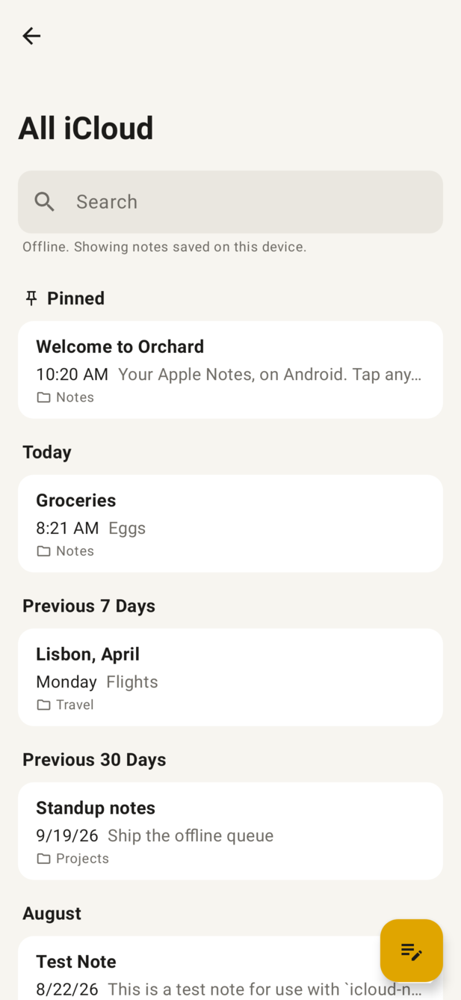
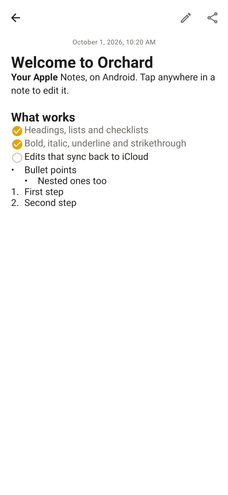
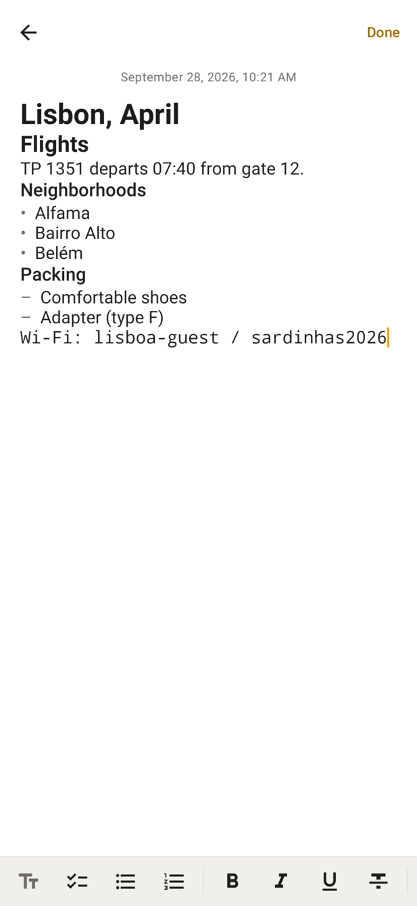
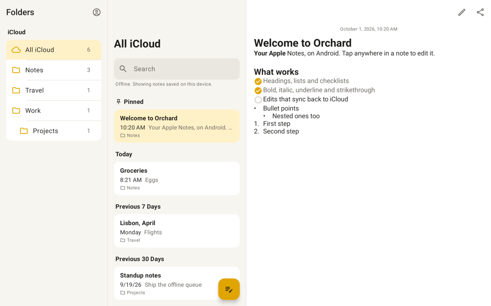

# Orchard Notes

An Android app for reading and editing your Apple Notes through your iCloud account, the way www.icloud.com/notes does, but native, offline-capable and fast.

<p>
  
  
  
</p>


> **Unofficial.** Apple has no public Notes API. Orchard talks to the same private CloudKit service the iCloud web app uses and writes Apple's internal note format. It is built to refuse any write it can't verify, but Apple can change things at any time. Keep backups, and try edits on a test note first.

## Features

- **Sign in with Apple's own page.** Password, two-factor codes and CAPTCHAs are handled by icloud.com inside the app; Orchard never sees your password. The session survives restarts.
- **Browse like Apple Notes.** Folders (nested), All iCloud, Recently Deleted, pinned notes, Today / Previous 7 Days / ... sections, and instant search over titles and text.
- **Faithful rendering.** Title, heading, subheading, body and monospaced paragraphs, bulleted, dashed and numbered lists, checklists, block quotes, bold, italic, underline, strikethrough, highlights, colors and links. Photos, drawings and scans show inline.
- **Editing.** Tap a note to edit it in place, with a formatting toolbar and checklist circles you can tick. Changes save as you type.
- **Works offline.** Every edit, new note, move, delete and new folder is saved on the device first and queued. The queue pushes as soon as iCloud is reachable, even if the app was closed (WorkManager with a network constraint).
- **Safe with other devices.** Edits are written as CRDT operations, the same way Apple's clients write them, so they merge on your iPhone, iPad and Mac. If a note changed elsewhere while you were offline, the two versions are merged by paragraph. If the same paragraph changed on both sides, your version is saved as a separate note instead of overwriting.
- **Organize.** Move notes between folders, delete to Recently Deleted (with Undo), recover, delete permanently, and create folders.
- **Adaptive layout.** One pane on phones, list and note side by side on mid-size screens, and folders, list and note on tablets and unfolded foldables. Light and dark themes.
- **Escape hatch.** Anything not handled natively (locked notes, tables, adding attachments) opens in iCloud.com's Notes app inside Orchard, using the same session.

## Requirements

- An Apple ID with **iCloud Notes** turned on.
- **Advanced Data Protection must be off.** With ADP on, note contents are end-to-end encrypted and the web services this app uses can't read them (Settings > [your name] > iCloud > Advanced Data Protection on an Apple device).
- Accounts in mainland China (iCloud operated by GCBD, icloud.com.cn) aren't supported yet.
- Android 8.0 or newer.

## Install

Build a debug APK and install it over USB:

```bash
./gradlew assembleDebug
adb install -r app/build/outputs/apk/debug/app-debug.apk
```

Building needs JDK 17+ and the Android SDK with platform 37 (Android Studio's defaults are fine; set `sdk.dir` in `local.properties` if the SDK is elsewhere). `./gradlew assembleRelease` produces a minified build signed with the local debug key, for personal sideloading.

To install on a phone: enable *Developer options* (Settings > About phone > Software information > tap *Build number* seven times), turn on *USB debugging*, connect the phone, accept the prompt on it, and run the `adb install` line above.

## How it works

| Layer | Where | What it does |
|---|---|---|
| Sign-in | `auth/`, `ui/signin/` | Hosts www.icloud.com in a WebView. A script injected only into that origin reads the web client's own `accountLogin` / `validate` responses to detect a completed sign-in (2FA included). The WebView cookie store is shared with the HTTP client. |
| CloudKit | `cloudkit/` | `changes/zone`, `records/lookup` and `records/modify` on the `com.apple.notes` container, with the same parameters as the web client. |
| Cache and sync | `data/` | Room cache of notes and folders, incremental sync tokens, pending edits and operations, and the push pipeline (`NoteWriter`). |
| Note format | `notes/` | Order-preserving protobuf codec; Apple's `topotext` CRDT model, edit engine, formatting reconciler; record field builders; paragraph-level three-way merge. |
| UI | `ui/` | Compose: browser (folders, list, adaptive layout), note view and editor, iCloud.com fallback. |

Every write to an existing note goes through these gates: fetch a fresh copy, require the server's document to re-encode **byte for byte** through Orchard's model, refuse edits that would touch embedded objects, apply the change as CRDT operations, then decode the rebuilt document independently and compare its text, formatting and attachments before uploading with optimistic concurrency (`recordChangeTag`). Notes that fail a gate stay readable, and the app explains why they're read-only.

## Limitations

- Tables, sketches and scanned documents can't be edited here (they display; tables as a card).
- Attachments can't be added. Existing ones are kept intact around your edits.
- Locked (password-protected) notes open only through the iCloud.com fallback.
- Notes that other people shared with you aren't listed (they live in a separate shared database). Notes you shared with others are listed and editable.
- Pinning, renaming or deleting folders, and hashtags/mentions as tokens aren't supported yet.
- Very large notes whose text is stored as a separate asset are read-only.

If the iCloud sign-in page doesn't load, the sign-in screen's ⋮ menu has *Troubleshooting info*: what the page loaded, any errors it reported, and what it shows right now, ready to share.

## Development

```bash
./gradlew testDebugUnitTest                      # unit tests (no device needed)
./gradlew testDebugUnitTest -Pscreenshots --tests '*AppScreenshots*'   # renders app/build/screenshots/*.png
```

The tests include real captured note payloads, an end-to-end write path against a mock CloudKit server, the ported CRDT test suite, and editor behaviour.

Debug builds have a demo mode with sample notes and no account (it behaves as if offline):

```bash
adb shell am start -n dev.rortega.orchardnotes/.MainActivity --ez demo true
```

## Credits

The note format knowledge and CRDT edit engine are ported from [icloud-md](https://github.com/coddingtonbear/icloud-md) by Adam Coddington (MIT); see [THIRD_PARTY_NOTICES.md](THIRD_PARTY_NOTICES.md). The field report in [Notes-Of-Fruit](https://github.com/ericmigi/Notes-Of-Fruit) informed several safety choices. Apple, iCloud and Apple Notes are trademarks of Apple Inc.; this project is not affiliated with Apple.
